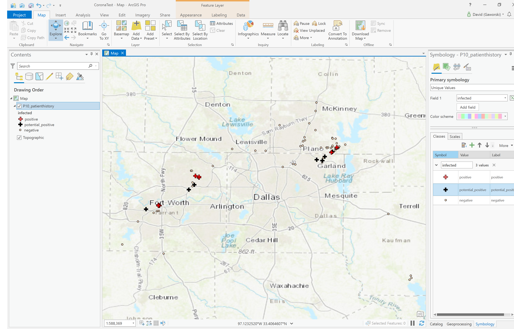

# Tracking Community Spread from Google Location History



## Script

Python Imports Needed:

```
from arcgis import GIS
from arcgis import *
import arcgis
import zipfile
import json
import os
from datetime import datetime
from shapely.geometry import Point
import pandas as pd
import geopandas as gpd
import matplotlib.pyplot as plt
```
```
#inputs
startyear = "2020"
startmonth = "2020_JANUARY"
patientid = "P10"

googlemapslocationhistory = r"C:\Users\david\OneDrive\Documents\CoronaNotebook\Data\takeout-20200314T005214Z-001.zip"

confirmedinfecteddate = ["2020-03-08","2020-03-14" ]
estimatedinfectiondate = ["2020-03-01", "2020-03-07"]

#variables
staginglocation = r"C:\Users\david\OneDrive\Documents\CoronaNotebook\Staging"
patientdatafolder = staginglocation + "\\" + patientid + r"\Takeout\Location History\Semantic Location History" + "\\" + startyear
patientlocationhistory = []

#dervied variables
patientstagingfolder = staginglocation + "\\" + patientid

confirmedinfecteddate[0],confirmedinfecteddate[1] = datetime.fromisoformat(confirmedinfecteddate[0]),datetime.fromisoformat(confirmedinfecteddate[1])
estimatedinfectiondate[0],estimatedinfectiondate[1]  = datetime.fromisoformat(estimatedinfectiondate[0]), datetime.fromisoformat(estimatedinfectiondate[1])
```

```
def unzipgooglelocationhistory():
    with zipfile.ZipFile(googlemapslocationhistory, 'r') as zip_ref:
        zip_ref.extractall(patientstagingfolder)
        
        
def getpatientlocationhistory(patientdatafolder):
    for filename in os.listdir(patientdatafolder):
        f = open(patientdatafolder + "\\" + filename) 
        data = json.load(f) 
        for d in data["timelineObjects"]:
            if ('placeVisit' in d.keys()):
                date = datetime.fromtimestamp(int(d['placeVisit']['duration']['startTimestampMs'])/1000).strftime('%Y-%m-%d')
                date = datetime.fromisoformat(date)

                if (estimatedinfectiondate[1] >= date >= estimatedinfectiondate[0]):
                    infectedstatus = "potential_positive"
                    
                elif (confirmedinfecteddate[1] >= date >= confirmedinfecteddate[0]):
                    infectedstatus = "positive"
                else:
                    infectedstatus = "negative"

                for place in d['placeVisit']:
                    row = {
                        "patientid": patientid,
                        "lat": d['placeVisit']['location']['latitudeE7']/ 1e7,
                        "lon": d['placeVisit']['location']['longitudeE7']/ 1e7,
                        "timestart": datetime.fromtimestamp(int(d['placeVisit']['duration']['startTimestampMs'])/1000).strftime('%Y-%m-%d %H:%M:%S'),
                        "timeend": datetime.fromtimestamp(int(d['placeVisit']['duration']['endTimestampMs'])/1000).strftime('%Y-%m-%d %H:%M:%S'),
                        "infected": infectedstatus
                    }
                    patientlocationhistory.append(row)

            if ('activitySegment' in d.keys()):
                
                date = datetime.fromtimestamp(int(d['activitySegment']['duration']['startTimestampMs'])/1000).strftime('%Y-%m-%d')
                date = datetime.fromisoformat(date)
                
                if (estimatedinfectiondate[1] >= date >= estimatedinfectiondate[0]):
                    infectedstatus = "potential_positive"
                    
                elif (confirmedinfecteddate[1] >= date >= confirmedinfecteddate[0]):
                    infectedstatus = "positive"
                else:
                    infectedstatus = "negative"
                    
                for place in d['activitySegment']:
                    if d['activitySegment'][place] == 'WALKING':
                        try:
                            for waypoint in d['activitySegment']['waypointPath']['waypoints']:
                                row = {
                                    "patientid": patientid,
                                    "lat": waypoint['latitudeE7']/ 1e7,
                                    "lon": waypoint['longitudeE7']/ 1e7,
                                    "timestart": datetime.fromtimestamp(int(d['activitySegment']['duration']['startTimestampMs'])/1000).strftime('%Y-%m-%d %H:%M:%S'),
                                    "timeend": datetime.fromtimestamp(int(d['activitySegment']['duration']['endTimestampMs'])/1000).strftime('%Y-%m-%d %H:%M:%S'),
                                    "infected": infectedstatus
                                }
                                patientlocationhistory.append(row)

                        except:
                            pass


def patienthistoryjson2shapefile(patientlocationhistory):
    df = pd.DataFrame(patientlocationhistory)

    df['geometry'] = df.apply(lambda row: Point(row.lon,row.lat),axis=1)
    gdf = gpd.GeoDataFrame(df, geometry = 'geometry')
    gdf.crs = "EPSG:4326"

    gdf.to_file(driver = 'ESRI Shapefile', filename= "patienthistory.shp")
    gdf.to_file(patientstagingfolder + "\\" + patientid + "_patienthistory2.shp")
    
    #run and append to your big data or something
    
    return gdf
```

```
unzipgooglelocationhistory()

getpatientlocationhistory(patientdatafolder)

gdf = patienthistoryjson2shapefile(patientlocationhistory)
```

```
#not needed, but cool to see without GIS software.

patienthistory = arcgis.features.GeoAccessor.from_geodataframe(gdf, inplace=True, column_name='geometry')

m = gis.map()
m.add_layer(patienthistory)
m.extent = patienthistory

m
```
## Meta

Your Name – David Gaworski

Distributed under the anyone can use this license.

[https://github.com/davidgaworski/communityspreadfromgooglelocationhistory](https://github.com/davidgaworski/)
